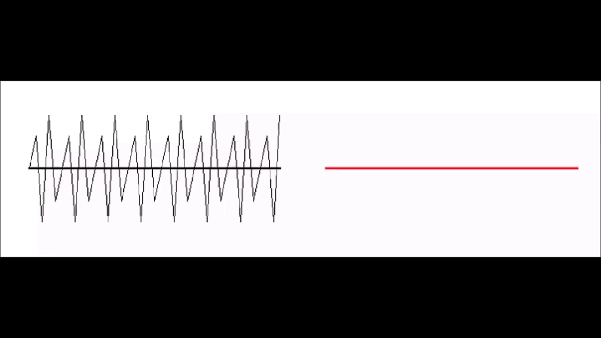
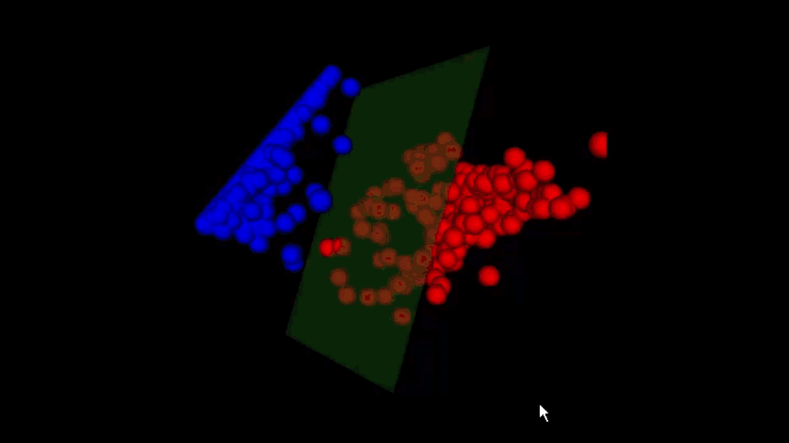
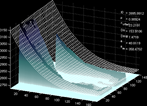
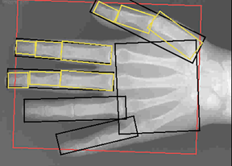

# Personal Details 

<table class="tg">
<thead>
  <tr>
    <td class="tg-73oq"></td>
    <td class="tg-73oq"></td>
  </tr>
  <tr>
    <td class="tg-73oq">Name</td>
    <td class="tg-73oq">Behiels</td>
  </tr>
  <tr>
    <td class="tg-73oq">First name</td>
    <td class="tg-73oq">Gert</td>
  </tr>
  <tr>
    <td class="tg-73oq">Date of birth</td>
    <td class="tg-73oq">Feb 1972</td>
  </tr>
  <tr>
    <td class="tg-73oq">Place of residence</td>
    <td class="tg-73oq">Edegem - Belgium</td>
  </tr>
  <tr>
    <td class="tg-73oq">Nationality</td>
    <td class="tg-73oq">Belgian</td>
  </tr>
</thead>
</table>

# Portfolio

## Gridlines suppression
Automatic detection, modelling and correction of static anti-scatter grids in digital RX.

### Task
Build upon the technology of the [Microlens-artefact correction](Portfolio.md#microlens-artefact-correction) project, a filter was designed to remove the anti scatter gridlines from the image. The high frequent pattern caused aliasing within the NX workstation display. On the left image in the animation you can see moire-artifacts, after filtering zooming in the right filtered images keeps the image clear.

### Action
Patent searches showed that it was not trivial to suppress the gridlines while keeping the contrast needed for diagnostic imaging. Based on wavelet decomposition, I managed to develop a non-linear filter which was able to perfectly separate the diagnostic image content from the gridlines. Even steep edges are not affected by the filtering. 

 

The detection of the grid was implemented with Fourier Analysis and Support Vector Machines.
The red dots indicate the images without grid and the blue dots the images with grid. The threshold is shifted to the red dots in order not to miss any grid, since the filter is very conservative for these images the filtering does not have any effect.

### Result
A new method for gridlines filtering, validated for CR and DR imaging

### Responsibilities
Software Developer

## Microlens-artefact correction
Automatic correction of periodic- and stitching artefacts with real-time implementation for DX-S.

### Task
Agfa’s new digitizer uses microlens array to read out the CR phosphor plates. When the phosphor plates are slightly out of focus, a periodic pattern with the period of the microlenses was visible. During the production assembly of the same digitizer, the glue between the microlens arrays caused a different refraction which disturbed the image signal.

### Action
Because the frequency of the microlenses arrays lies within the frequency range of the diagnostic content in the image, simple band stop filters also removed diagnostic content. I implemented a solution where the period signal was modelled with wavelets and where the wavelet coefficients are filtered to separate the diagnostic content from the microlens artefacts1. To correct the refraction artifact, a reference signal was taken and made deformable. This reference signal is adapted to best fit the image artifact2. The initial filter, designed in matlab, took 3 minutes to process one image. Different optimization techniques and tricks are implemented to reach the processing requirement of 1.5 seconds, the time needed for the digitizer to read the CR phosphor plate. The final filter was generated with a code generator because the resulting code was too complex to maintain by hand.

### Result
A validated filter which was able to process the images within time. During the lifetime of the digitizer, not a single bug or issue was filed.

### Responsibilities
Software Developer

## Statistical models of anatomical structures in digital RX
In this IWT-project and associated PhD, this was my introduction to image processing in general and medical image processing in particular. The project was done within the [Medical Image Computing](https://www.kuleuven.be/samenwerking/mirc/research-groups/MIC/mission.html) group at the [Medical Imaging Research Center](https://www.kuleuven.be/samenwerking/mirc/index.html) at the [University Hospital UZ Leuven - Gasthuisberg](https://www.uzleuven.be/en/gasthuisberg).

### Task

The main task of this project was the automatic registration, segmentation and classification of bones in digital RX for [automatic bone age assessment](https://en.wikipedia.org/wiki/Bone_age) with “[active shape models](https://en.wikipedia.org/wiki/Active_shape_model)”.  In order to build the models, [non rigid point matching](https://www.cise.ufl.edu/~anand/students/chui/tps-rpm.html) was used to align several manual segmented bones. The segmentation was made ‘efficient’ by using dynamic programming within a special UI application. Before registration large scale inhomogeneities caused by the heel effect are compensated. The registration is done hierarchically, where first the hand is located and this location is further drilled down to fingers and bones. The position of the bones is used as a starting position for the active shape models. 

