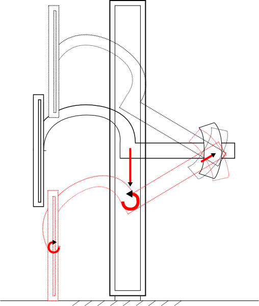
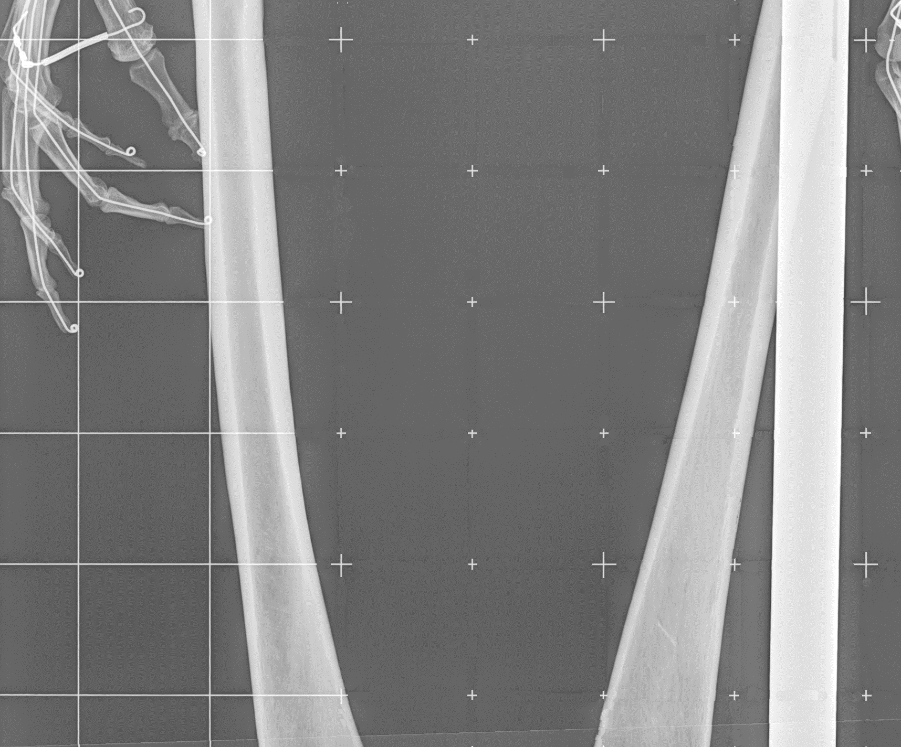

# Personal Details 

<table class="tg">
<thead>
  <tr>
    <td class="tg-73oq"></td>
    <td class="tg-73oq"></td>
  </tr>
  <tr>
    <td class="tg-73oq">Name</td>
    <td class="tg-73oq">Behiels</td>
  </tr>
  <tr>
    <td class="tg-73oq">First name</td>
    <td class="tg-73oq">Gert</td>
  </tr>
  <tr>
    <td class="tg-73oq">Date of birth</td>
    <td class="tg-73oq">Feb 1972</td>
  </tr>
  <tr>
    <td class="tg-73oq">Place of residence</td>
    <td class="tg-73oq">Edegem - Belgium</td>
  </tr>
  <tr>
    <td class="tg-73oq">Nationality</td>
    <td class="tg-73oq">Belgian</td>
  </tr>
</thead>
</table>

# Portfolio

## DR Roadmap

### Task
Identify opportunities for Agfa to improve its portfolio within Direct Radiography.

### Action
Together with application and marketing, we contacted several radiographers and radiologists and interviewed them for their opinion on features, future vision, possible improvements, new technology. 

### Result
The result was a roadmap where key topics were identified: mobile imaging, workflow, improved diagnosis and image consistency. This was the beginning of the development of the 
[Tomosynthesis](Portfolio.md#tomosynthesis), 
[SmartXR](Portfolio.md#smartxr) and 
[Deep learning projects](Portfolio.md#deep-learning-projects).

### Responsibilities
Innovation Manager, Software Architect, Team Lead

## Full Leg Full Spine
Automatic image stitching of DR images. 

### Task
Develop a method for FLFS (Full Leg Full Spine) imaging for DR images with similar quality requirements as the one-shot CR FLFS.

### Action
I developed the interface to the modality, the module computing the optimal position of the images while keeping the X-ray source stable and the image processing module which stitches the images and detects possible patient movement during the acquisition. Because the old C R stitch grid, could not be used, I developed a new stitch grid which was enabled the correction of the patient movement and which was less disturbing for the radiologist. With the mechanical team in Munich, I co-designed a patient stand which ensures that the patient could stand still and protected the patient from the moving parts of the modality.

### Result
A new stitch grid, a new patient stand and new, more robust algorithms were designed, implemented and validated. 

### Responsibilities
Project Lead, Software Developer

