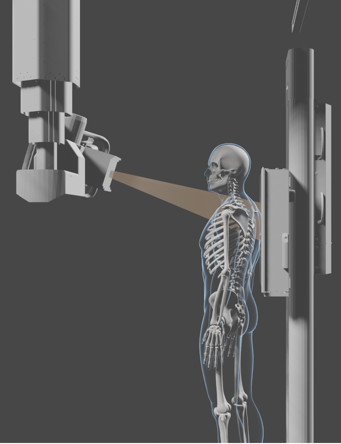
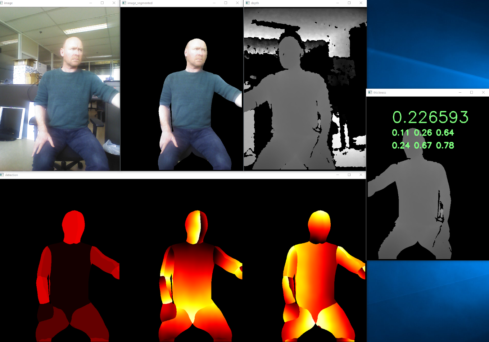

# Personal Details 

<table class="tg">
<thead>
  <tr>
    <td class="tg-73oq"></td>
    <td class="tg-73oq"></td>
  </tr>
  <tr>
    <td class="tg-73oq">Name</td>
    <td class="tg-73oq">Behiels</td>
  </tr>
  <tr>
    <td class="tg-73oq">First name</td>
    <td class="tg-73oq">Gert</td>
  </tr>
  <tr>
    <td class="tg-73oq">Date of birth</td>
    <td class="tg-73oq">Feb 1972</td>
  </tr>
  <tr>
    <td class="tg-73oq">Place of residence</td>
    <td class="tg-73oq">Edegem - Belgium</td>
  </tr>
  <tr>
    <td class="tg-73oq">Nationality</td>
    <td class="tg-73oq">Belgian</td>
  </tr>
</thead>
</table>

# Portfolio

## Deep learning projects

### Thickness estimation

{: style="float: left"}
This is a feasibility project at Agfa where the chest thickness of a patient is estimated from an image taken with a depth camera. Because data collection of patients since the introduction of the 
[GDPR](https://en.wikipedia.org/wiki/General_Data_Protection_Regulation) 
is very difficult, the deep learning model training set was simulated with virtual patients, generated by 
[makehuman](http://www.makehumancommunity.org/) and 
[blender](https://www.blender.org/). 
The inputs to the 
[EfficientNet](https://arxiv.org/abs/1905.11946) 
network are the depth maps and thickness maps. 
The depth maps are distances from the camera to the patient, segmented by the [DensePose](http://densepose.org/) network.
The thickness maps are distances or thickness of the patient along the X-ray path. 
Both maps are generated by blender. |

In order to obtain the thickness of the patient, the average of the estimated thickness maps across the chest region was computed and used as the chest thickness. In the graph, the blue dots are the distribution of the thickness estimations of the training data and the red dots the predicted result of unseen virtual patients. While transferring these virtual results to reality, the DensePose network was not stable enough to be used at the SIDs (Source to Image Distance) which are typical for mobile chest X-rays. 

Currently, we are collecting data with a new chest measurement solution using the depth camera. 
I am also looking into a new method that estimates the thickness without the need for a pre-segmentation step.

### Blindness detection

{: style="float: left"}
While the team was actively implementing segmentation and detection networks, 
I wanted to check our position compared to the rest of the deep learning community.
In order to check my skills for deep learning, I participated in the [APTOS 2019 Blindness Detection competition](https://www.kaggle.com/c/aptos2019-blindness-detection/overview). 

I ended at place 319 out of 2928 teams in the private leaderboard, where the algorithm is tested on unseen data. 
Provided that I had more time – it was summer-holiday – and more computing power to also include the data from a [previous competition](https://www.kaggle.com/c/diabetic-retinopathy-detection), I think I could have ended in the top 100. 

The training and inference was done on a custom-build gaming computer with a NVida RTX 2080 Ti GPU.

### Other projects

**segmentation**: in this project the segmentation part of the [Musica](https://medimg.agfa.com/main/musica/) algorithm was replaced with a deep learning technique. 
The results of the old algorithm were used as inputs to train the UNet with a MobileNet encoder.

**autorate**: part of the [SmartXR](https://medimg.agfa.com/main/direct-radiography/smartxr/) features. For portable images, the orientation of the X-ray is determined and corrected.

**boneage**: automatic bone age determination with attention networks on the [RSNA Pediatric Bone Age Challenge 2017](https://www.rsna.org/education/ai-resources-and-training/ai-image-challenge/rsna-pediatric-bone-age-challenge-2017) dataset

### Responsibilities
Researcher, Software Architect, Team Coach

