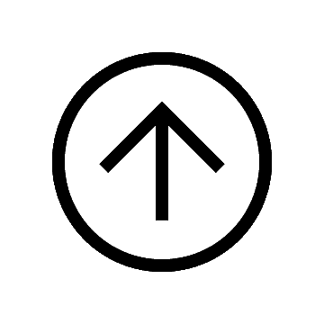
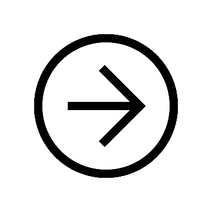

# Personal Details 

<table class="tg">
<thead>
  <tr>
    <td class="tg-73oq"></td>
    <td class="tg-73oq"></td>
  </tr>
  <tr>
    <td class="tg-73oq">Name</td>
    <td class="tg-73oq">Behiels</td>
  </tr>
  <tr>
    <td class="tg-73oq">First name</td>
    <td class="tg-73oq">Gert</td>
  </tr>
  <tr>
    <td class="tg-73oq">Date of birth</td>
    <td class="tg-73oq">Feb 1972</td>
  </tr>
  <tr>
    <td class="tg-73oq">Place of residence</td>
    <td class="tg-73oq">Edegem - Belgium</td>
  </tr>
  <tr>
    <td class="tg-73oq">Nationality</td>
    <td class="tg-73oq">Belgian</td>
  </tr>
</thead>
</table>

# Extracurricular Activities

- Volunteer at [speelpleinwerking](https://www.lokeren.be/subsites/speloke/) (1989-1990).
- Active in the student praesidium for [WINA](https://www.wina.be/nl/).
- Volenteer at the [Stadsschouwburg Antwerpen](http://www.stadsschouwburg-antwerpen.be/nl)	
- Volenteer for concerts in [Lotto Arena](http://www.lotto-arena.be/nl) and [Sportpaleis](https://www.sportpaleis.be/nl)

# Hobbies

- Passionate windsurfer and skier. 
- Playing badminton, running or biking when there is no wind or snow.
- Team captain of the best veteran badminton team in Antwerp, where best stands for fair play, humor and tactical excellence.
- Hobby cook
- 3D Printing, CNC and laser cutting

# Interests
- Music
- Design
- Culture
- Travel

# Projects for rainy days
- [metArt](http:://www.metart.be)
- [WordClock](https://github.com/Gearlux/NeoWordClock)
- [Deep Learning](https://www.kaggle.com/gearlux)

