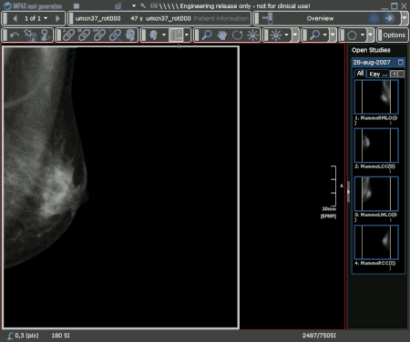

# Portfolio

## Mammography Workstation
Innovative, automatic methods to enhance mammography hanging protocols.

### Task
Having access to many image processing methods for mammo, I was asked to contribute to the development of Agfa’s new mammography workstation, developed within the Agility project.

### Action

|  | Nipple Alignment   Zoom To Breast |   |

With the application team, I identified a couple of features which were technically feasible to implement: nipple/breast alignment, background darkening, zoom to breast.  I also implemented a workflow engine, that can be configured to support the workflow that is used within a particular hospital. In addition, I invented and implemented UI improvements like synchronized zooming and a new zooming method for PACS applications. After a couple of years, I became team lead of the mammography workstation, leading a remote team of developers in Vienna. For the backend, I was the architect for a structured report engine extension which enabled many image processing addons, including third party applications.

### Result
The results was the state of the art mammography workstation, which still is being demoed on RSNA and ECR as one of the flagships in the Agfa PACS portfolio.

### Responsibilities
Scrum Master, Team Lead, Software Architect, Application Support, Software developer

## CAD for mammo
Automatic detection and classification of micro-calcifications and masses in mammographies.

### Task
This project was part of a government sponsored project with several work packages. I was the project lead for the mammograph package. 

### Action
After a presegmentation of the mammography, more than 15000 features are extracted for each candidate region. These features are sorted with an information criterion and classified with an ensemble of classifiers popular within the data mining community. 

### Result

The result was a CAD engine, superior to the existing R2 cad engine. Prof. Carla Boetes† was so enthusiastic that she wanted to get European Funding to continue this project. Unfortunately, because of lack of interest from Agfa’s management and the passing away of Prof. Boetes, the project was stopped. To bypass FDA regulations for CAD engines, we amplified the detections of the micro-calcification engine within a Musica package, leaving the diagnosis up to the radiologists. Because of the strong amplification, it is nearly impossible for the radiologist to miss the malignant calcification, even after a long working day.

 
 
### Responsibilities
Project Lead, Software Architect, Software Developer

