<table class="tg">
<thead>
  <tr>
    <td class="tg-73oq">Name</td>
    <td class="tg-73oq">Behiels</td>
    <td class="tg-73oq" rowspan="5">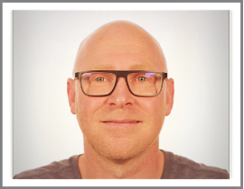</td>
    <td class="tg-73oq" rowspan="5">
</td>

  </tr>
  <tr>
    <td class="tg-73oq">First name</td>
    <td class="tg-73oq">Gert</td>
  </tr>
  <tr>
    <td class="tg-73oq">Date of birth</td>
    <td class="tg-73oq">Feb 1972</td>
  </tr>
  <tr>
    <td class="tg-73oq">Place of residence</td>
    <td class="tg-73oq">Edegem - Belgium</td>
  </tr>
  <tr>
    <td class="tg-73oq">Nationality</td>
    <td class="tg-73oq">Belgian</td>
  </tr>
</thead>
</table>

# Portfolio

## SmartXR
Technology innovation project for automatic patient thickness measurement and augmented reality with depth cameras. Optimising workflow with the aid of intelligent sensors and artificial intelligence: [SmartAlign](https://www.youtube.com/watch?v=9JK6VvTmHKw&list=PLZUHziR7BH05hZpypM6EbExV5jlN15Dge&index=3&ab_channel=AgfaRadiologySolutions), [SmartDose](https://www.youtube.com/watch?v=hFiWwWdyD-8&list=PLZUHziR7BH05hZpypM6EbExV5jlN15Dge&index=4&ab_channel=AgfaRadiologySolutions), [SmartRotate](https://www.youtube.com/watch?v=qIXslnTsih4&list=PLZUHziR7BH05hZpypM6EbExV5jlN15Dge&index=5&ab_channel=AgfaRadiologySolutions), [SmartPositioning](https://www.youtube.com/watch?v=CkWlYKfAxLE&list=PLZUHziR7BH05hZpypM6EbExV5jlN15Dge&ab_channel=AgfaRadiologySolutions). 

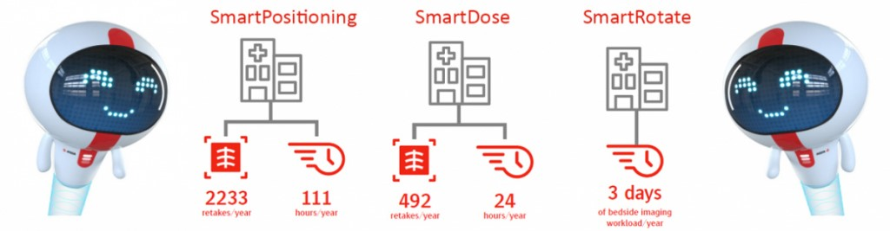
 
### Task
The main goal of this project is to assist the radiographers in their workflow while taking X-Ray images. Because the experience of the radiographers has reduced the last decades, I saw the opportunity for Agfa to implement a program to raise the knowledge bar and assist the radiographers in their daily work with [SmartXR](https://medimg.agfa.com/main/direct-radiography/smartxr/).

### Action
After a prioritization round, the first four pillars for SmartXR were determined. This included the estimation of risk, effort and value from a large set of features. Collaboration with universities for the different topics were set up, work was divided across multiple teams and development followed up. With custom trello scripts, overview gantt charts are created combining all phases, steps and projects.

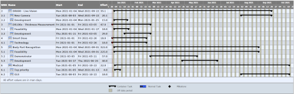
   

### Result
The result of this project was one of the largest successful product launches of Agfa. The project is now the core of new features being implemented to further assist and automate the workflow of the radiographer. 

### Responsibilities
Project Planning, Software Architect, Researcher

## Deep learning projects

### Thickness estimation
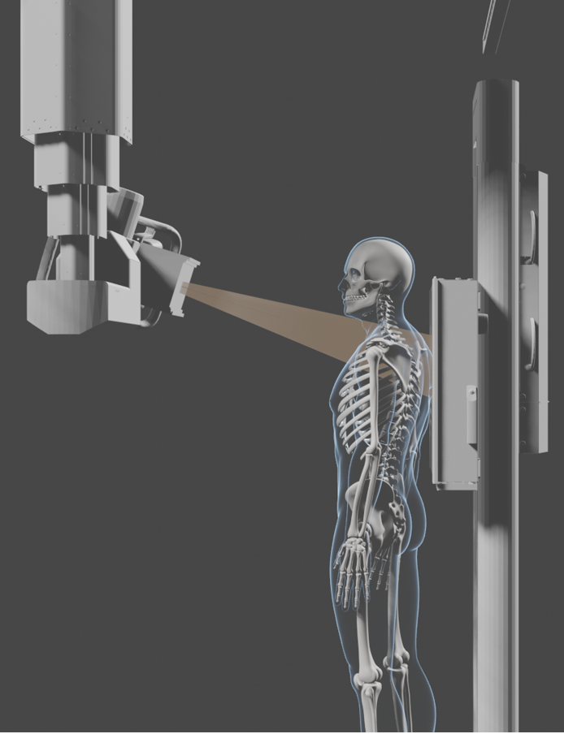

This is a feasibility project at Agfa where the chest thickness of a patient is estimated from an image taken with a depth camera. Because data collection of patients since the introduction of the 
[GDPR](https://en.wikipedia.org/wiki/General_Data_Protection_Regulation) 
is very difficult, the deep learning model training set was simulated with virtual patients, generated by 
[makehuman](http://www.makehumancommunity.org/) and 
[blender](https://www.blender.org/). 
The inputs to the 
[EfficientNet](https://arxiv.org/abs/1905.11946) 
network are the depth maps, distances from the camera to the patient, segmented by the 
[DensePose](http://densepose.org/) network and the thickness maps, thickness of the patient along the X-ray path. Both maps were generated by blender. In order to obtain the thickness of the patient, the average of the estimated thickness maps across the chest region was computed and used as the chest thickness. In the graph, the blue dots are the distribution of the thickness estimations of the training data and the red dots the predicted result of unseen virtual patients. While transferring these virtual results to reality, the DensePose network was not stable enough to be used at the SIDs (Source to Image Distance) which are typical for mobile chest X-rays. 

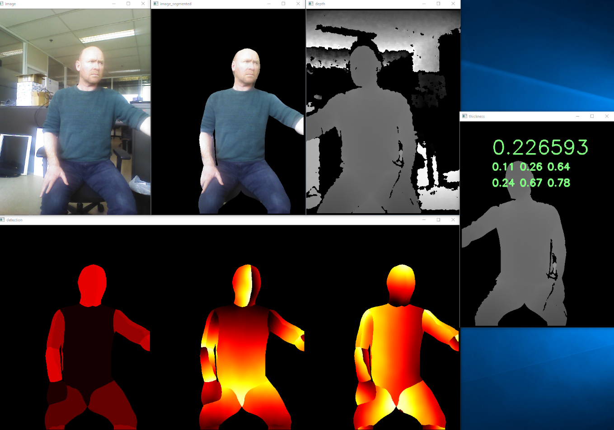
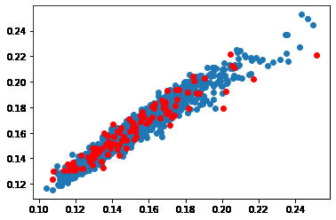

### Blindness detection

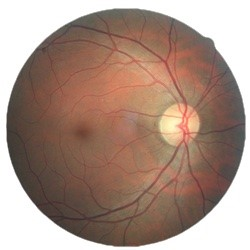

In order to check my skills for deep learning, I participated in the [APTOS 2019 Blindness Detection competition](https://www.kaggle.com/c/aptos2019-blindness-detection/overview). I ended at place 319 out of 2928 teams in the private leaderboard, where the algorithm is tested on unseen data. Provided that I had more time – it was summer-holiday – and more computing power to also include the data from a [previous competition](https://www.kaggle.com/c/diabetic-retinopathy-detection), I think I could have ended in the top 100. 

### Responsibilities
Software Architect, Team Coach

## Tomosynthesis
Innovation project for 3D image reconstruction and mobile tomosynthesis.

### Task
The goal of [tomosynthesis](https://medimg.agfa.com/main/direct-radiography/tomosynthesis/) is to simulate 
a volume image from a set of X-ray images taken at different angles. 
Such a volume stacks, reduces the overlap of anatomical structures.

### Action
After some prototyping, I created the interface to the modality to acquire the images. I also wrote the core of the tomosynthesis reconstruction engine. As far as I know, this is still the fastest iterative reconstruction engine today.

### Result
The developed software is now used as a clinical product and is the base of further development within this product range.

### Responsibilities
Project Lead, Software Architect, Software Developer, GPU/CUDA development

## DR Roadmap

### Task
Identify opportunities for Agfa to improve its portfolio within Direct Radiography.

### Action
Together with application and marketing, we contacted several radiographers and radiologists and interviewed them for their opinion on features, future vision, possible improvements, new technology. 

### Result
The result was a roadmap where key topics were identified: mobile imaging, workflow, improved diagnosis and image consistency. This was the beginning of the development of the 
[Tomosynthesis](Portfolio.md#tomosynthesis), 
[SmartXR](Portfolio.md#smartxr) and 
[Deep learning projects](Portfolio.md#deep-learning-projects).

### Responsibilities
Innovation Manager, Software Architect, Team Lead

## Full Leg Full Spine
Automatic image stitching of DR images. 

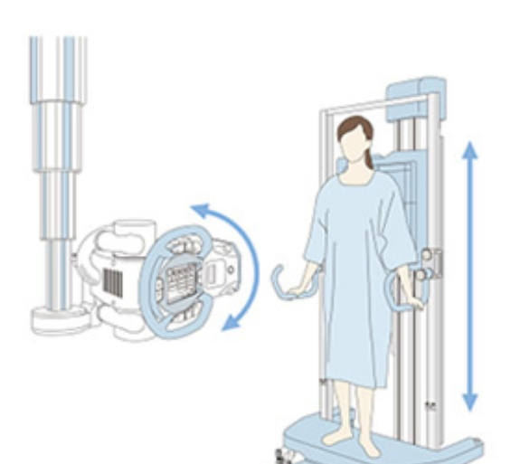

### Task
Develop a method for FLFS (Full Leg Full Spine) imaging for DR images with similar quality requirements as the one-shot CR FLFS.

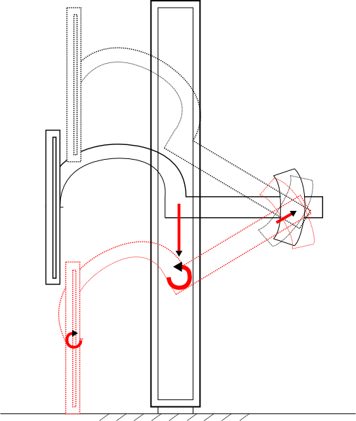

### Action
I developed the interface to the modality, the module computing the optimal position of the images while keeping the X-ray source stable and the image processing module which stitches the images and detects possible patient movement during the acquisition. Because the old C R stitch grid, could not be used, I developed a new stitch grid which was enabled the correction of the patient movement and which was less disturbing for the radiologist. With the mechanical team in Munich, I co-designed a patient stand which ensures that the patient could stand still and protected the patient from the moving parts of the modality.

### Result
A new stitch grid, a new patient stand and new, more robust algorithms were designed, implemented and validated. 

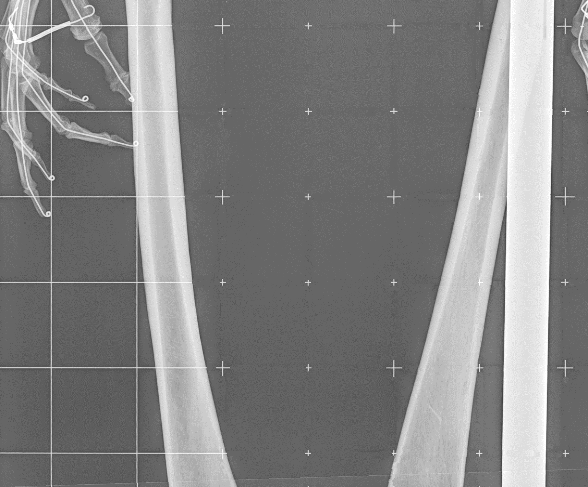

### Responsibilities
Project Lead, Software Developer

## Mammography Workstation
Innovative, automatic methods to enhance mammography hanging protocols.

### Task
Having access to many image processing methods for mammo, I was asked to contribute to the development of Agfa’s new mammography workstation, developed within the Agility project.

### Action

| 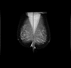 | Nipple Alignment   Zoom To Breast | 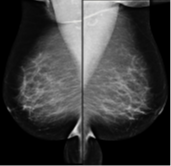  |

With the application team, I identified a couple of features which were technically feasible to implement: nipple/breast alignment, background darkening, zoom to breast.  I also implemented a workflow engine, that can be configured to support the workflow that is used within a particular hospital. In addition, I invented and implemented UI improvements like synchronized zooming and a new zooming method for PACS applications. After a couple of years, I became team lead of the mammography workstation, leading a remote team of developers in Vienna. For the backend, I was the architect for a structured report engine extension which enabled many image processing addons, including third party applications.

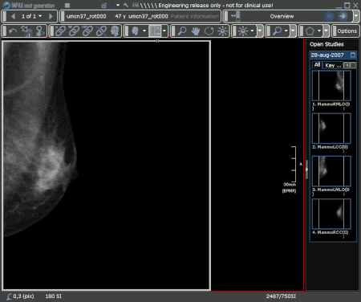

### Result
The results was the state of the art mammography workstation, which still is being demoed on RSNA and ECR as one of the flagships in the Agfa PACS portfolio.

### Responsibilities
Scrum Master, Team Lead, Software Architect, Application Support, Software developer

## CAD for mammo
Automatic detection and classification of micro-calcifications and masses in mammographies.

### Task
This project was part of a government sponsored project with several work packages. I was the project lead for the mammograph package. 

### Action
After a presegmentation of the mammography, more than 15000 features are extracted for each candidate region. These features are sorted with an information criterion and classified with an ensemble of classifiers popular within the data mining community. 

### Result
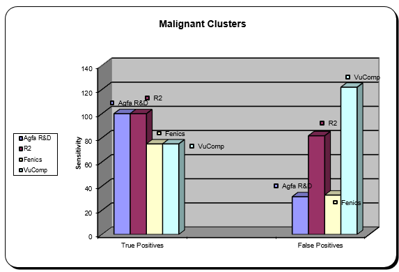

The result was a CAD engine, superior to the existing R2 cad engine. Prof. Carla Boetes† was so enthusiastic that she wanted to get European Funding to continue this project. Unfortunately, because of lack of interest from Agfa’s management and the passing away of Prof. Boetes, the project was stopped. To bypass FDA regulations for CAD engines, we amplified the detections of the micro-calcification engine within a Musica package, leaving the diagnosis up to the radiologists. Because of the strong amplification, it is nearly impossible for the radiologist to miss the malignant calcification, even after a long working day.

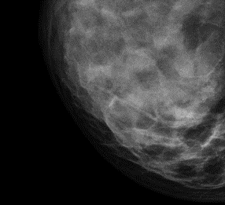 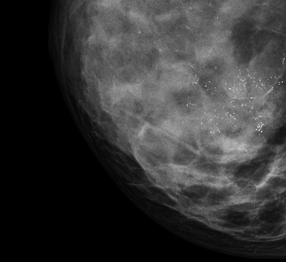
 
### Responsibilities
Project Lead, Software Architect, Software Developer

## Gridlines suppression
Automatic detection, modelling and correction of static anti-scatter grids in digital RX.

### Task
Build upon the technology of the [Microlens-artefact correction](Portfolio.md#microlens-artefact-correction) project, a filter was designed to remove the anti scatter gridlines from the image. The high frequent pattern caused aliasing within the NX workstation display. On the left image in the animation you can see moire-artifacts, after filtering zooming in the right filtered images keeps the image clear.

### Action
Patent searches showed that it was not trivial to suppress the gridlines while keeping the contrast needed for diagnostic imaging. Based on wavelet decomposition, I managed to develop a non-linear filter which was able to perfectly separate the diagnostic image content from the gridlines. Even steep edges are not affected by the filtering. 

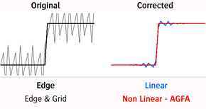 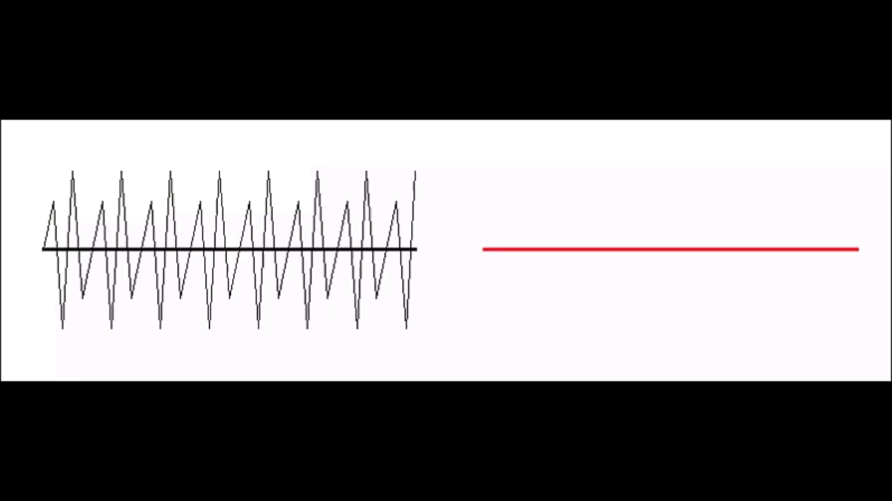

The detection of the grid was implemented with Fourier Analysis and Support Vector Machines.
The red dots indicate the images without grid and the blue dots the images with grid. The threshold is shifted to the red dots in order not to miss any grid, since the filter is very conservative for these images the filtering does not have any effect.

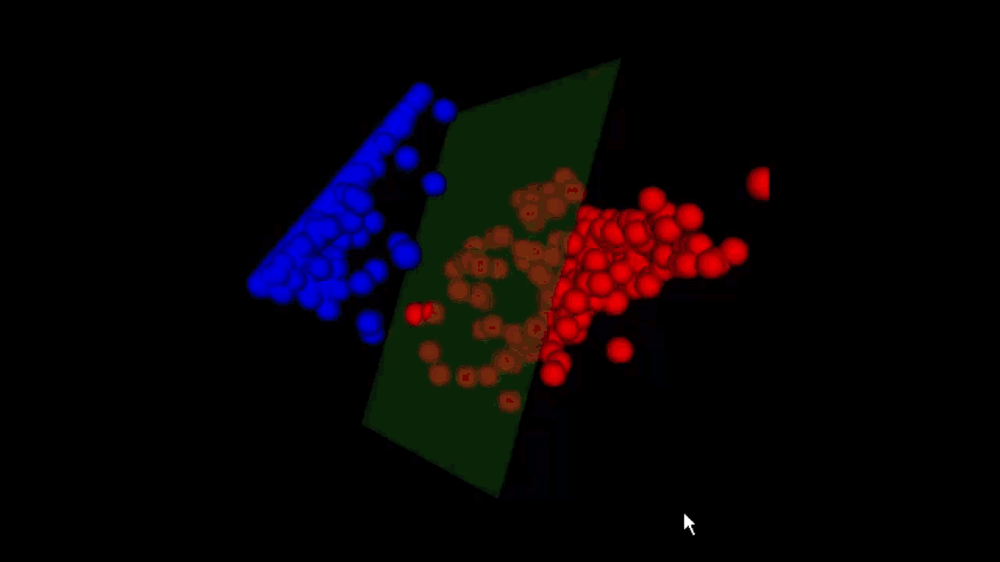

### Result
A new method for gridlines filtering, validated for CR and DR imaging

### Responsibilities
Software Developer

## Microlens-artefact correction
Automatic correction of periodic- and stitching artefacts with real-time implementation for DX-S.

### Task
Agfa’s new digitizer uses microlens array to read out the CR phosphor plates. When the phosphor plates are slightly out of focus, a periodic pattern with the period of the microlenses was visible. During the production assembly of the same digitizer, the glue between the microlens arrays caused a different refraction which disturbed the image signal.

### Action
Because the frequency of the microlenses arrays lies within the frequency range of the diagnostic content in the image, simple band stop filters also removed diagnostic content. I implemented a solution where the period signal was modelled with wavelets and where the wavelet coefficients are filtered to separate the diagnostic content from the microlens artefacts1. To correct the refraction artifact, a reference signal was taken and made deformable. This reference signal is adapted to best fit the image artifact2. The initial filter, designed in matlab, took 3 minutes to process one image. Different optimization techniques and tricks are implemented to reach the processing requirement of 1.5 seconds, the time needed for the digitizer to read the CR phosphor plate. The final filter was generated with a code generator because the resulting code was too complex to maintain by hand.

### Result
A validated filter which was able to process the images within time. During the lifetime of the digitizer, not a single bug or issue was filed.

### Responsibilities
Software Developer

## Statistical models of anatomical structures in digital RX
In this IWT-project and associated PhD, this was my introduction to image processing in general and medical image processing in particular. The project was done within the [Medical Image Computing](https://www.kuleuven.be/samenwerking/mirc/research-groups/MIC/mission.html) group at the [Medical Imaging Research Center](https://www.kuleuven.be/samenwerking/mirc/index.html) at the [University Hospital UZ Leuven - Gasthuisberg](https://www.uzleuven.be/en/gasthuisberg).

### Task
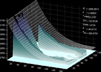

The main task of this project was the automatic registration, segmentation and classification of bones in digital RX for [automatic bone age assessment](https://en.wikipedia.org/wiki/Bone_age) with “[active shape models](https://en.wikipedia.org/wiki/Active_shape_model)”.  In order to build the models, [non rigid point matching](https://www.cise.ufl.edu/~anand/students/chui/tps-rpm.html) was used to align several manual segmented bones. The segmentation was made ‘efficient’ by using dynamic programming within a special UI application. Before registration large scale inhomogeneities caused by the heel effect are compensated. The registration is done hierarchically, where first the hand is located and this location is further drilled down to fingers and bones. The position of the bones is used as a starting position for the active shape models. 

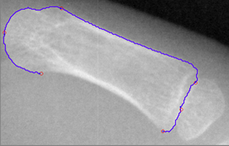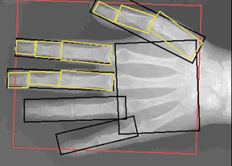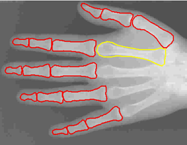