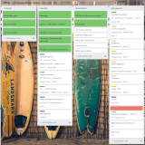

# Personal Details 

<table class="tg">
<thead>
  <tr>
    <td class="tg-73oq"></td>
    <td class="tg-73oq"></td>
  </tr>
  <tr>
    <td class="tg-73oq">Name</td>
    <td class="tg-73oq">Behiels</td>
  </tr>
  <tr>
    <td class="tg-73oq">First name</td>
    <td class="tg-73oq">Gert</td>
  </tr>
  <tr>
    <td class="tg-73oq">Date of birth</td>
    <td class="tg-73oq">Feb 1972</td>
  </tr>
  <tr>
    <td class="tg-73oq">Place of residence</td>
    <td class="tg-73oq">Edegem - Belgium</td>
  </tr>
  <tr>
    <td class="tg-73oq">Nationality</td>
    <td class="tg-73oq">Belgian</td>
  </tr>
</thead>
</table>

# Portfolio

## [SmartXR](https://medimg.agfa.com/main/direct-radiography/smartxr/)
Technology innovation project for automatic patient thickness measurement and augmented reality with depth cameras. Optimising workflow with the aid of intelligent sensors and artificial intelligence: [SmartAlign](https://www.youtube.com/watch?v=9JK6VvTmHKw&list=PLZUHziR7BH05hZpypM6EbExV5jlN15Dge&index=3&ab_channel=AgfaRadiologySolutions), [SmartDose](https://www.youtube.com/watch?v=hFiWwWdyD-8&list=PLZUHziR7BH05hZpypM6EbExV5jlN15Dge&index=4&ab_channel=AgfaRadiologySolutions), [SmartRotate](https://www.youtube.com/watch?v=qIXslnTsih4&list=PLZUHziR7BH05hZpypM6EbExV5jlN15Dge&index=5&ab_channel=AgfaRadiologySolutions), [SmartPositioning](https://www.youtube.com/watch?v=CkWlYKfAxLE&list=PLZUHziR7BH05hZpypM6EbExV5jlN15Dge&ab_channel=AgfaRadiologySolutions). 

 
### Task
The main goal of this project is to assist the radiographers in their workflow while taking X-Ray images. Because the experience of the radiographers has reduced the last decades, I saw the opportunity for Agfa to implement a program to raise the knowledge bar and assist the radiographers in their daily work with [SmartXR](https://medimg.agfa.com/main/direct-radiography/smartxr/).  

### Action
After a prioritization round, the first four pillars for SmartXR were determined. This included the estimation of risk, effort and value from a large set of features. Collaboration with universities for the different topics were set up, work was divided across multiple teams and development followed up. With custom trello scripts, overview gantt charts are created combining all phases, steps and projects.

Besides the planning, I was technically responsible for the selection and calibration of the camera's. Agfa's choice not to use industrial grade depth camera's, has led to a calibration method of consumer camera's which could be performed quickly on site by a service technician. For the mobile system, where we could not rely on a fixed pattern and a calibrated system, our calibration method was further simplified, with a focus on the accuracy within the X-ray beam field.

In addition, I designed the streaming platform to transfer the depth and color image from the modality to the modality workstation. 
The software module on the workstation uses a flexible new image processing framework.
This framework enabled a fast and smooth transition from research to development code.

Currently, I am still working on new 'demonstrators' which showcase the potential of new features before being implemented into new product features.  One of these demonstrators is a small framework to create instructional videos for difficult exams, where each of the steps which needs to be performed by the radiographers is illustrated with a virtual patient or avatar.   

<video controls autoplay loop height="320">  <source src="movies/rockwood.mp4" type="video/mp4"></video>

We are also looking to extend the current camera setup with multiple camera's. 
For a correct registration of al these camera's, I developed a hybrid registration technique where the depth information of the depth camera is combined with regular camera registration techniques.

### Result
The result of this project was one of the largest successful product launches of Agfa. The project is now the core of new features being implemented to further assist and automate the workflow of the radiographer. 

### Responsibilities
Project Planning, Software Architect, Researcher

