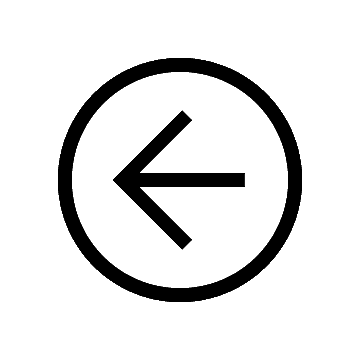

# Personal Details 

<table class="tg">
<thead>
  <tr>
    <td class="tg-73oq"></td>
    <td class="tg-73oq"></td>
  </tr>
  <tr>
    <td class="tg-73oq">Name</td>
    <td class="tg-73oq">Behiels</td>
  </tr>
  <tr>
    <td class="tg-73oq">First name</td>
    <td class="tg-73oq">Gert</td>
  </tr>
  <tr>
    <td class="tg-73oq">Date of birth</td>
    <td class="tg-73oq">Feb 1972</td>
  </tr>
  <tr>
    <td class="tg-73oq">Place of residence</td>
    <td class="tg-73oq">Edegem - Belgium</td>
  </tr>
  <tr>
    <td class="tg-73oq">Nationality</td>
    <td class="tg-73oq">Belgian</td>
  </tr>
</thead>
</table>

# Portfolio

## Tomosynthesis

Innovation project for 3D image reconstruction and mobile tomosynthesis.

One of the topics identified in the DR roadmap, was new imaging techniques based on X-ray.
Together with [fluoroscopy](https://medimg.agfa.com/main/direct-radiography/dr-800/), 
[tomosynthesis](https://medimg.agfa.com/main/direct-radiography/tomosynthesis/) was needed to fill the gap in Agfa's DR portfolio.

### Task

The goal of [tomosynthesis](https://medimg.agfa.com/main/direct-radiography/tomosynthesis/) is to simulate 
a volume image from a set of X-ray images taken at different angles. 
Such a volume stack, reduces the overlap of anatomical structures.

### Action

After some prototyping, I created the interface to the modality to acquire the images. I also wrote the core of the tomosynthesis reconstruction engine. As far as I know, this is still the fastest iterative reconstruction engine for tomosynthesis today.

The first reconstruction engine was developed in OpenCL. 
Because the OpenCL extensions at that time did not allow the use of native textures, the engine was rewritten in CUDA.

### Result
The developed software is now used as a clinical product and is the base of further development within this product range.

[//]: # (Include images of the tomosynthesis game)

### Responsibilities
Project Lead, Software Architect, Software Developer, GPU/CUDA development

