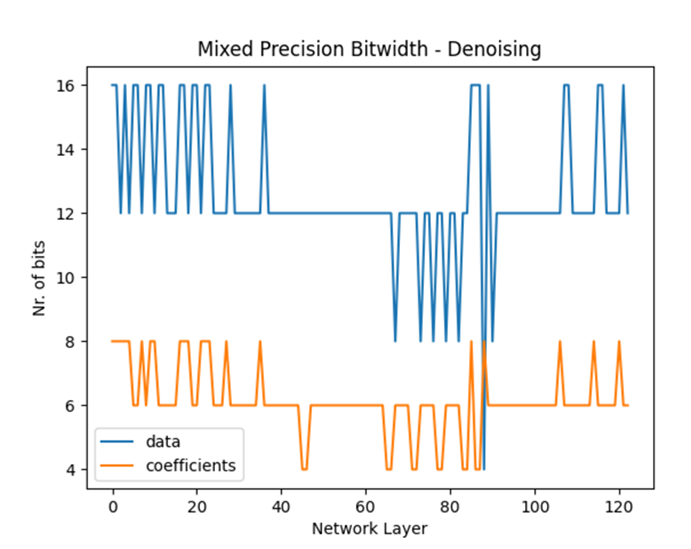
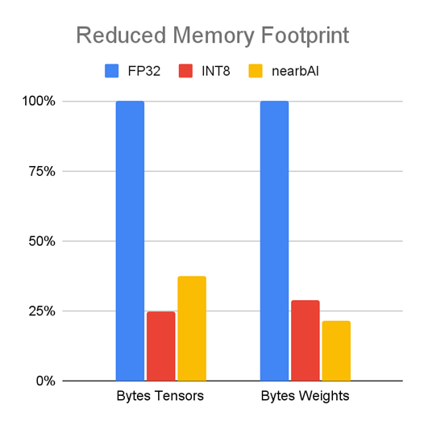
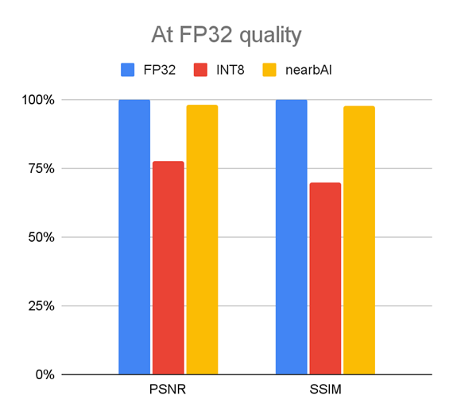
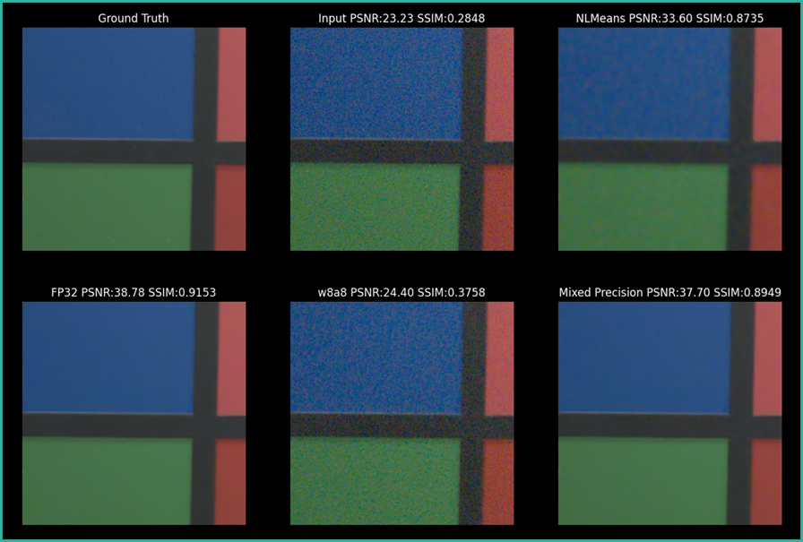
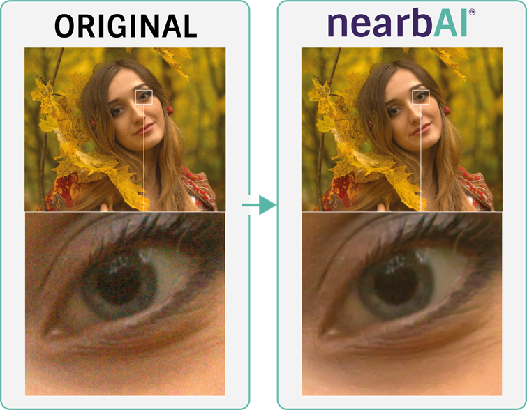

# Personal Details 

<table class="tg">
<thead>
  <tr>
    <td class="tg-73oq"></td>
    <td class="tg-73oq"></td>
  </tr>
  <tr>
    <td class="tg-73oq">Name</td>
    <td class="tg-73oq">Behiels</td>
  </tr>
  <tr>
    <td class="tg-73oq">First name</td>
    <td class="tg-73oq">Gert</td>
  </tr>
  <tr>
    <td class="tg-73oq">Date of birth</td>
    <td class="tg-73oq">Feb 1972</td>
  </tr>
  <tr>
    <td class="tg-73oq">Place of residence</td>
    <td class="tg-73oq">Edegem - Belgium</td>
  </tr>
  <tr>
    <td class="tg-73oq">Nationality</td>
    <td class="tg-73oq">Belgian</td>
  </tr>
</thead>
</table>

# Portfolio

## Neural Network accelerator

### Denoising network

Because one of Easics' customers is a company specialized in camera's and needs ISP capabilities, I also focused on the development of a denoising network. Because quantization of a [PMRID](https://github.com/MegEngine/PMRID) network resulted in suboptimal denoising, I developed a mixed-precision algorithm that reduced the bitwidth across the layers.
For the activations, we managed to do most of the computations in 12-bit, while some of the middle layers are processed in 8- or 4-bit. For the weights, most layers are computed in 6-bit, some even in 4-bit.

With this technique, the memory footprint and the related power consumption is reduced by almost a factor of 4 while retaining the quality of a FP32 network. To summarize, run the network at INT8 memory footprint, speed and power consumption but with FP32 quality.

#### Technical images

In the next image, we put synthetic noise on a technical image ([PSNR](https://en.wikipedia.org/wiki/Peak_signal-to-noise_ratio) of 23.23 and [SSIM](https://en.wikipedia.org/wiki/Structural_similarity_index_measure) of 0.2848). 
An optimized [NLMeans](https://en.wikipedia.org/wiki/Non-local_means) algorithms is capabled to increase the PSNR to 33.60, while the FP32 implementation of PMRID boost the PSNR to 38.78 and SSIM to 0.9153. The 8-bit quantized network (w8a8) only increases the quality a little bit, while the mixed precision algorithm surpasses the NLMeans implementation, almost at the same quality level of the FP32 implementation

#### Real images

The denoising network not only performs good on syntethic data. 
When we take a RAW bayer image from the internet, we manage to almost completely remove the noise.

