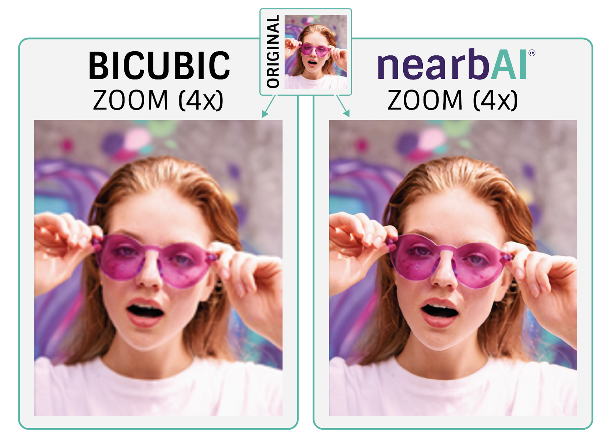
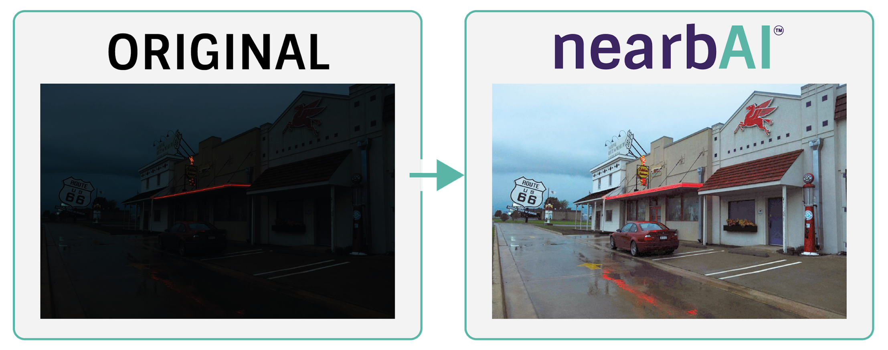

# Personal Details 

<table class="tg">
<thead>
  <tr>
    <td class="tg-73oq"></td>
    <td class="tg-73oq"></td>
  </tr>
  <tr>
    <td class="tg-73oq">Name</td>
    <td class="tg-73oq">Behiels</td>
  </tr>
  <tr>
    <td class="tg-73oq">First name</td>
    <td class="tg-73oq">Gert</td>
  </tr>
  <tr>
    <td class="tg-73oq">Date of birth</td>
    <td class="tg-73oq">Feb 1972</td>
  </tr>
  <tr>
    <td class="tg-73oq">Place of residence</td>
    <td class="tg-73oq">Edegem - Belgium</td>
  </tr>
  <tr>
    <td class="tg-73oq">Nationality</td>
    <td class="tg-73oq">Belgian</td>
  </tr>
</thead>
</table>

# Portfolio

## Neural Network accelerator

The project started as a heavily optimized neural network compiler when I joined the team.
Due to the heavy optimizations, specifically tuned for networks in the [DarkNet](https://pjreddie.com/darknet/) framework, 
the compiler was not robust for new networks defined in [ONNX](https://onnx.ai/), [tensorflow lite](https://www.tensorflow.org/lite) or [pytorch](https://pytorch.org/).

I managed the transition of a complete in-house developed framework to a compiler based on the [TVM](https://tvm.apache.org/) framework.
This transition was the base of a robust compiler and also led to an optimized design of the hardware.
Within this new design, the accelerator instructions are more complex but for a single convolution, not more than 7 instructions are needed.
In the first design, the number of instructions was dependent on the size of the input tensors, which led to a bottleneck on the memory bus.

The new design is also further optimized to cope with the depthwise/pointwise convolutions present in most modern backbones (eg. [MobileNets](https://arxiv.org/abs/1704.04861))

During summer, I was asked to do a feasibility study for ISP pipelines to process and improve raw Bayer images.
This led to the implementation of following networks on our accelerator:

### Super-Resolution

Very simple network, which is basically an re-implementation of [QuickSRNet](https://arxiv.org/abs/2303.04336).

### Night Vision

I am not entirely happy with the results of this [IAT](https://github.com/cuiziteng/Illumination-Adaptive-Transformer)-based transformer network, but we needed a transformer network as example for the accelerator. This network works well for dark images, but if only part of the image is underexposed, the bright parts become overexposed.

