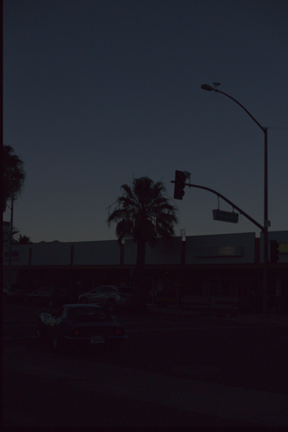
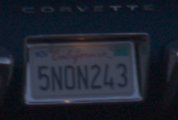
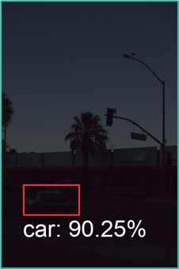
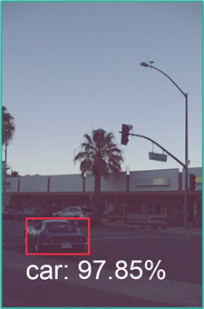
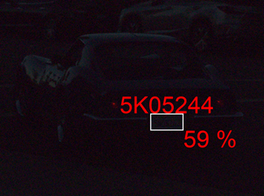
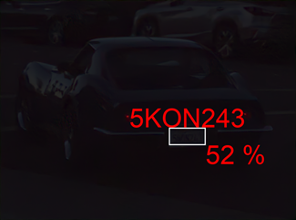
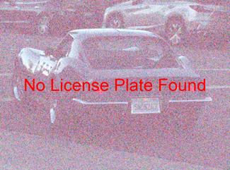
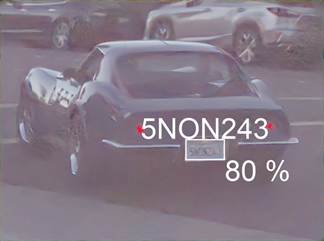

# Portfolio

## Neural Network accelerator

### License plate recognition

Let's see how the NightVision network and the Denoising network can be used to optimize the license plate recognition of following image.

Taken from an image with a longer exposure time, we know that the license plate is **5NON243**

#### Car detection

The original image above is a 20MP image. Processing such an image requires a lot of processing power.
To recognize the license plate, we first detect the car on a low resolution image with the a `fasterrcnn_mobilenet_v3_large_320_fpn` network. 
We see that by applying the NightVision network first, the confidence of car detection increases from **90%** to **97%**. 

 

If you look closely to the images, you can also see that the bounding box of the car on the original image is a little bit too small, not completely including the license plate.

#### License plate recognition

Let's further extend the image processing pipeline. 
We use following  [license plate recognizer](https://platerecognizer.com/) to identify the license plate on the original and derived images.

<table class="tg">
<thead>
<tr> <td> <strong>Original</strong> </td> <td> <strong>Denoised</strong> </td> </tr> 
<tr> 
<td>  </td>
<td>  </td>
</tr>
<tr> <td><strong>Night Vision</strong></td> <td><strong>Denoised + Night Vision</strong></td> </tr>
<td>  </td>
<td>  </td>
</thead>
</table>

Construction of a good image processing pipeline, when done in the correct order, can improve the results of classification and detection networks.

